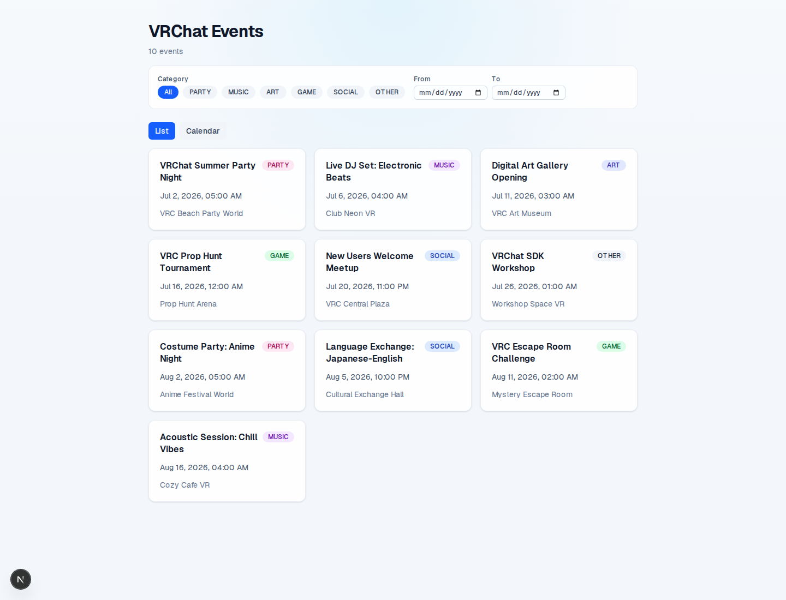

# Build a VRChat Event Calendar with IDD

<!-- cspell:words Defang VRChat -->

This workshop follows an end-to-end IDD session that builds a realistic
VRChat event calendar example.

## What You Will Build

By the end of the workshop, you will have watched IDD turn a fresh
repository into a working VRChat Event Calendar MVP. The app lists
events, shows event details, supports creator-owned edits, and gives
readers enough local infrastructure to run tests before each merge.

The example repository lives at
[`kurone-kito/vrc-event-calendar`](https://github.com/kurone-kito/vrc-event-calendar).
Track A now treats that public repository as the live companion
artifact for the workshop. It starts from a template baseline and will
evolve into the final VRChat Event Calendar app as the workshop issues
land. Treat it as the "look over the shoulder" counterpart to this
edited narrative: the workshop explains the IDD decisions, while the
repository shows the code and configuration those loops build over
time.

## Prerequisites

Before starting, make sure you can run the same baseline tools the
agents use during the workshop:

- Docker Desktop, or an equivalent Docker Engine setup with Docker
  Compose support, for PostgreSQL and the local app stack.
- Node.js 22.22.2 or newer on the 22.x line, or Node.js 24 or newer,
  matching this repository's supported runtime.
- Corepack with pnpm 10 enabled for this repository's validation
  commands; Node.js also includes npm for example-app commands that use
  npm.
- Git and a GitHub account that can create branches, open pull requests,
  post issue and PR comments for IDD markers, request reviews, and read
  CI results.
- GitHub CLI (`gh`), authenticated for the account you will use during
  the workshop.
- `jq` and `curl`, or equivalent JSON and REST-client tools, for the IDD
  phases that inspect GitHub API responses or post operational markers
  directly.
- Copilot, Codex, or another coding agent that can follow the IDD phase
  instructions and operate through GitHub issues and pull requests.

The workshop also introduces PostgreSQL, Prisma, Tailwind CSS, Vitest,
and Playwright as it builds the app. You do not need to install each of
those separately before reading; the setup steps explain where they enter
the project.

## Prologue: Bootstrap

IDD has a chicken-and-egg bootstrap problem: a brand-new repository
cannot ask agents to follow its local IDD instructions until those
instructions, policy files, and agent entry documents already exist.
Theirs-flow is the deliberate way through that gap. Instead of asking a
non-operational repository to review its own missing bootstrap files,
you accept a trusted template baseline first and defer normal review to
the work that follows.

In this workshop, that baseline comes from the `idd-template` bundle in
this repository. The onboarding pass copies the template instructions
and policy files into `kurone-kito/vrc-event-calendar`, replaces the
repository-specific placeholders, records the local policy choices, and
then runs validation to confirm that the imported state is coherent.
That narrow "take the template as theirs" exception is what turns an
empty repository into one that can safely run the normal
claim -> work -> PR -> CI -> merge loop afterward.

For the exact command sequence and outputs, see the
[bootstrap log segment](log-segments/01-bootstrap.md). It shows the real
session order: claim and worktree setup, template import, placeholder
replacement, repository-specific customization, and validation with
`idd-doctor`. After this section, your repository is IDD-operational.

## Step 1: Development Environment

Infrastructure comes before features because IDD can only merge safely
when the repository can prove the same branch state every time. Before
the workshop starts adding Prisma models, API routes, or UI screens, the
example repository needs a scaffold that can build, lint, and boot in a
repeatable way. That is why Track B begins with environment work instead
of feature work: CI is not garnish in IDD, it is part of the merge gate.

Track B1 is the first full IDD loop in the workshop. The agent claims
`idd-skill#555`, narrows scope to the Next.js 15 scaffold, validates the
app on the host and inside a container, opens PR #3, waits for CI, and
merges once the checks go green. That single cycle shows the whole
claim -> work -> PR -> CI -> merge rhythm in one place, with enough
detail for a first-time reader to see not just what happened, but why
the agent made each decision.

After B1 merges, the infrastructure track can fan out into B2-B8
instead of serializing on one long-lived bootstrap branch. Formatting
(`#556`), Docker Compose (`#554`), and Docker hardening (`#644`) are
the first merged follow-up lanes, while test runners (`#562`, `#563`),
CI wiring (`#564`), and developer scripts (`#565`) remain explicitly
queued in the log. For the full timestamped record, see
[Track B — Infrastructure Setup](log-segments/02-infrastructure.md).
The narrower point this section closes on is that the merged B1-B4
baseline is green, which is why the preserved completion digest can
truthfully say, "All quality gates are now green."

## Step 2: Data Layer

The data layer establishes the event model and database contract that all
later tracks depend on. Track C runs three IDD loops:

- **C1** — Prisma bootstrap + Event schema: `@prisma/client` installed,
  `prisma init` creates the datasource, `EventCategory` enum and `Event`
  model defined.
- **C2** — Initial migration + DB singleton: `prisma migrate dev --name init`
  produces the SQL migration; `src/lib/db.ts` exports a cached
  `PrismaClient` singleton.
- **C3** — Seed script: `prisma/seed.ts` written with 10 sample events
  covering all six categories, using `upsert` for idempotent re-seeding.

By the end of Track C the local PostgreSQL database is schema-current and
populated with sample events ready for the API layer.

Log segment: [Track C — Data Layer](log-segments/03-data-layer.md)

## Step 3: Backend API

Track D builds the REST API surface six IDD cycles at a time. D1 shows
the complete loop in detail — claim, plan, implement, test, self-review,
PR, CI, merge — for `GET /api/events`. D2–D6 follow the same pattern and
are summarised:

- **D1** — `GET /api/events` with `category`, `date_from`, and `date_to`
  filters; `buildEventWhere` centralises the Prisma `where` clause.
- **D2** — `GET /api/events/[id]`: 200/404/400 responses.
- **D3** — `POST /api/events`: generates a UUID creator token, returns it
  in `X-Creator-Token`; validates required fields and `endAt > startAt`.
- **D4** — `PUT /api/events/[id]`: `crypto.timingSafeEqual` token
  comparison; 200/403/404 responses.
- **D5** — `DELETE /api/events/[id]`: same token check; 204 No Content.
- **D6** — Zod validation schemas (`CreateEventSchema`, `UpdateEventSchema`)
  integrated into POST and PUT for structured field-level error responses.

All six endpoints have mocked Vitest coverage that exercises the route
handler without a live database.

Log segment: [Track D — Backend API](log-segments/04-backend-api.md)

## Step 4: Frontend

Track E and Track F build the browser experience across six UI issues and
four quality-hardening issues that run partly in parallel with Track D.

**Track E — UI (E1–E6):**

- **E1** — `EventCard` component and event list page (`/`): Server
  Component reads `searchParams`, calls `/api/events`, renders a grid.
- **E2** — Event detail page (`/events/[id]`): calls `notFound()` on
  missing IDs; shows all event fields including optional worldName.
- **E3** — Create form (`/events/new`): client component, stores the
  returned creator token in `localStorage`.
- **E4** — Edit form (`/events/[id]/edit`): pre-populates from the API;
  sends `PATCH`-style `PUT` with the stored token.
- **E5** — Delete button on the detail page: visible only when the
  creator token is present in `localStorage`.
- **E6** — Filter panel (`FilterPanel`): URL-synced category and date
  range controls; `CalendarView` component with monthly navigation.

**Track F — Quality hardening (F1–F4):**

- **F1** — Playwright smoke tests: three E2E paths covering event list,
  detail navigation, and create-then-redirect.
- **F2** — Date utility functions: `formatEventDate`, `isEventToday`,
  `dateRangeOverlaps`; Vitest coverage including UTC/JST midnight boundary.
- **F3** — Quality gate verification: lint, unit tests, CI green on all
  merged PRs.
- **F4** — README: prerequisites, Quick Start, and available-scripts table
  for the example repository.

Log segment: [Tracks E and F — Frontend and Quality](log-segments/05-frontend-quality.md)

## Conclusion: What Was Built

**[`kurone-kito/vrc-event-calendar`](https://github.com/kurone-kito/vrc-event-calendar)
— This is what we built.**

Over the course of the workshop, IDD turned an empty repository into a
working VRChat Event Calendar with:

- Event listing with category and date-range filters
- Monthly calendar view with event dots and navigation
- Event detail pages with creator-owned edit and delete
- REST API with Zod validation and constant-time token auth
- Vitest unit test coverage and Playwright E2E smoke tests
- Docker Compose local stack with PostgreSQL and seed data

### Implementation metrics

| Metric                                    | Value                                                |
| ----------------------------------------- | ---------------------------------------------------- |
| Total time (first to last PR merge)       | ~31 hours (2026-05-16 17:52 to 2026-05-18 01:08 JST) |
| IDD loop cycles (PRs merged)              | 35                                                   |
| Issues closed (idd-skill tracking issues) | ~40                                                  |
| Unit tests at completion                  | 58 (Vitest)                                          |
| E2E smoke tests                           | 3 (Playwright)                                       |

Every loop followed the same six-phase IDD pattern: **claim → plan →
implement → self-review → PR → CI → merge**. The parallel-track structure
(infrastructure, data layer, API, frontend, quality) let narrow,
independently-testable changes land continuously without long-lived
feature branches or merge traffic jams.

## What's Next

Once the local MVP is running, you can either ship it somewhere real or
keep using it as a practice ground for future IDD loops. The core
workshop stops at a working local app; everything below is optional and
can become its own small, claimable issue.

For deployment practice, follow the
[Defang deployment bonus](bonus-defang-deployment.md). It shows how to
turn the Docker Compose app into a hosted service while keeping human
account choices, browser login, and production secrets explicit.

Feature extension ideas:

- Add RSVP and attendance tracking so event hosts can estimate turnout
  before the event starts.
- Support recurring events so weekly meetups can be created once and
  expanded into future calendar entries.
- Store VRChat world thumbnails so each event card gives readers a quick
  visual cue before they open the detail page.
- Add notifications so creators can remind followers before an event
  begins or when event details change.
- Export events to Google Calendar so readers can keep their VRChat plans
  beside the rest of their schedule.
- Add moderation tools so maintainers can hide spam, fix broken event
  details, and keep the public calendar trustworthy.

For deeper IDD reference material, continue with the
[full idd-skill documentation](../index.md). If you want to suggest a
workshop improvement or share what you built, use the
[project issue queue](https://github.com/kurone-kito/idd-skill/issues)
as the community starting point.
